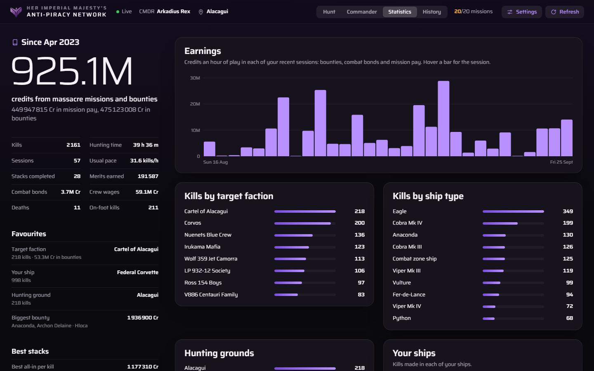

# Anti-Piracy Network

A live dashboard for pirate-massacre stacking in **Elite Dangerous**. It reads
your game journal while you play and shows how many kills your stack really
needs, which mission each kill is feeding, what the stack pays, and where to hand
in. It runs on your own PC, only reads the journal, and never goes online.

It dresses as the network of whichever Powerplay power you fly for (see
[Styles](#styles)); it works for any commander.

## Download

Windows builds are on the [Releases](../../releases) page: download
`Anti-Piracy-Network.exe` from the latest release and double-click it. Nothing to
install. (Older versions and release notes are there too.) It opens in a window of
its own and updates about once a second while you play; each launch starts with a short
welcome from your power's Anti-Piracy Network (click or press any key to skip
it). **Close the window to quit.** Opening the .exe again while it's running just
opens another window onto it.

The window is a Microsoft Edge app window (Edge ships with Windows), with its own
profile so it stays out of your normal browsing and remembers its size and
place. Without Edge or Chrome it opens as a tab in your usual browser instead;
`--tab` does that on purpose. Either way the dashboard is also at
<http://127.0.0.1:8765/> while the app runs.

The .exe isn't code-signed, so Windows may say it's from an unknown publisher.
Choose **More info → Run anyway**.

**From source, on any system with Python 3.9+:** download this repository and run

```bash
python stacker.py
```

or double-click `Start Anti-Piracy Network.bat` on Windows. It uses only Python's standard
library: there's nothing to `pip install`.

Your journal folder is found automatically at
`%USERPROFILE%\Saved Games\Frontier Developments\Elite Dangerous` (OneDrive
redirects too). If yours lives elsewhere, put a `config.json` beside the .exe (or
`stacker.py`):

```json
{ "journal_dir": "D:\\Games\\Elite Dangerous\\journal" }
```

## Why a stack needs counting

Massacre missions against the **same target faction in the same system** share
one kill stream, but only across **different giving factions**. Two missions from
the *same* giver don't stack with each other: they complete one after another.

So a stack costs the **biggest single giver's total**:

```
kills needed = max, over giving factions, of the sum of that faction's kill counts
```

A real example, five missions against the Vequess Brotherhood in Vequess:

```
Cemiess Commodities    15 + 4 + 9 + 15  = 43   <- queued, one at a time
Cemiess Empire Party             10     = 10   <- runs alongside them

cost of the stack = 43 kills   (not 53)
```

**So spread your missions across as many giving factions as you can.** Four
missions from four factions cost you however many the biggest has; four from one faction cost
all four added together.

## What you get

- **Kills to go**, for everything you hold, and per stack.
- **Each giver's queue on one kill scale**, so you can see which queue is
  longest (*sets the pace*) and where each
  queued mission starts ("Starts in 54 kills").
- **Free kills**: every giver behind the pace-setting queue shows how much room
  it has ("33 free"). Another mission from that giver of up to that many kills
  adds nothing to the stack's cost. Hover *sets the pace* for how big a mission
  from a faction not yet in the stack can be. Hidden while your mission slots
  are full.
- **A row of figures per stack**: next payout, time to finish, rewards, per kill
  and bounties. Hover any of them for the full amount and where it comes from.
  Time to finish uses this session's pace once you've made 10 kills against the
  stack, otherwise your usual pace from the journal.
- **Bounties** earned in the stack's system since it began, beside the mission
  rewards, because you often take materials or reputation instead of credits.
  Combat bonds are kept separate.
  Bounties show in **gold** when the system they were earned in pays a Powerplay
  bonus on cashing them in: +40% in A. Lavigny-Duval and Yuri Grom strongholds,
  +20% where they exploit (read off real cash-ins; it doesn't depend on your
  pledge). The gold figure is what they're worth cashed in there; hover it for
  the logged amount.
- **Expiry warnings**: a queued mission earns nothing until its turn. If it won't
  get its kills before its deadline at your pace, its deadline turns amber.
- **Target check**: lock a ship and the stack says whether killing it counts,
  whether it's the right faction in the wrong system, or whether it's clean and
  attacking it would be a crime.
- **Wanted alert**: if the game says you're wanted in the system you're in, a
  red line says so, with the bounty logged for your crimes there and who issued
  it. An unpaid fine gets an amber line. The game's own flag on your last jump
  in is the authority; paying off, or jumping back in clean, clears it.
- **Standing** with every mission provider (Neutral, Cordial, Friendly,
  Allied…). The journal only states it when you jump into that faction's space,
  so missions handed in since are added from their "+" marks, at the rate your
  own journal shows (about 4 points each).
- **This session**: time, kills, bounties, mission pay, merits and credits an
  hour, in a strip above the stacks.
- **Mission slots** used, against the game's limit of 20.
- **Ready to hand in**: finished missions grouped by station, in route order
  (nearest first, then nearest from each stop), with light years per leg.
- **Hand-in station on every mission**, worked out from where you were docked when
  you took it. Turn it off under **Settings** for a tighter list.

## Pages

Four pages, across the top:

- **Hunt**: the live stacks, everything above.
- **Commander**: this session in full (credits earned, kills an hour, bounties,
  bonds, mission pay, merits and your **crew share**, what your NPC fighter pilot
  has been paid as you cashed in), a **Copy session summary** button for Discord
  or a squadron log, your ranks, and every faction you hold missions from or
  hunt, with standing and any state it's in (Boom, War, Famine...). A relog
  within half an hour, to refresh the mission boards say, is the same session.
- **Statistics**: everything the journal has seen: lifetime earnings, a chart of
  credits an hour across your recent sessions, kills by target faction, ship
  type, system and your own ship, favourites and your biggest bounty, massacre
  missions taken, handed in and failed, crew wages, deaths, and every stack
  you've run.
- **History**: every session, newest first, each with its date and how long
  ago. Open one for its own statistics: figures, kills by faction, ship and
  system, the ships you flew and the stacks you worked.

### Ranks

- **Combat rank**, e.g. Master → Dangerous: how far along you are, what this
  session's kills have added, and about how many kills are left ("53% · +7.2%
  this session · about 525 kills to go"). The journal records combat progress
  only when you log in, so this session's share is estimated from how many ship
  kills each 1% has taken you at this rank before; hover the line for the rate.
  Once you've made 10 kills this session, it adds how long that is at your
  pace ("about 482 kills to go (8 h 45 m)").
- **Imperial Navy rank**, e.g. Duke → Prince: how far along you are, and what
  handing in your current Imperial missions should add ("44% · +6.6% after
  hand-in"). The estimate is measured from your own journal, which records your
  rank progress at every log-in; hover the line to see the rate it found.
- **Powerplay**: your rank and merits to the next one, with how long that is at
  this session's merit rate, plus merits this session.
  Rank thresholds (rank 6 at 23 000 merits, then every 8 000) were read off real
  rank-ups.

### Time played

Hunting time counts the gaps between events, with any pause over 10 minutes
treated as a break, so a stack spread over three evenings isn't credited with the
nights in between.



## How the kill count works

Mission *lists* and the kill *arithmetic* come straight from the journal and are
exact. Kill *progress* isn't, because the journal has no per-mission counter: the
app rebuilds it from your `Bounty` and `FactionKillBond` events.

The game doesn't always agree with your bounties. Across 81 massacre completions
in the author's journal:

- **46** came exactly when the bounties said they would;
- **21** came later: the game had counted fewer kills than it paid bounties for
  (6 of those in stacks where Pirates and Deserters, or Infected ships, of one
  faction were mixed; see below);
- **14** came earlier: the game counted kills that paid no bounty.

Nothing in a kill's journal entry tells a counted kill from an uncounted one. What
the game *does* say is when a mission is done, so the app uses that:

- **Every completion corrects the whole stack.** A completion says exactly how
  many of the kills logged since that mission started earning really counted,
  and every other mission in the stack earned from the same kills. With that,
  58 of those 81 completions come out exact, up from 46.
- **Nothing is marked finished before the game says so.** If a mission's logged
  kills already cover it but the game still lists it as active, the extra kills
  didn't count, and the whole stack is **held** there: rows read `9+ left` ("at
  least 9"), the mission holding things up is in amber, and the stack says how
  many kills didn't count. The next completion clears it.
- **Pirates, deserters and infected ships are told apart by what they say.** The
  journal logs their kills identically, but the NPCs announce themselves on the
  radio. A fight with pirate chatter counts for Pirates missions; one where
  nobody talks counts for Deserters missions while you hold one against that
  faction there (deserters fly silent), and for Pirates otherwise. Checked
  against every mixed stack in the author's journal: the Deserters and Pirates
  missions run together at Irukama both land exactly, where counting every kill
  for both had been 15 and 18 kills over.
- **Sync** is the escape hatch: type what the in-game transactions panel shows
  on a row; **Clear correction** removes it.

The first mission to complete in a stack can't be corrected in advance, because
nothing has completed yet to measure against. A small mission from a giver with
nothing queued behind it finishes soonest and re-measures the rest.

`--verify` prints every completion in your own journal with the logged count and
the corrected one.

## What the countdown means

It's the deadline to **finish the kills**, not to cash in. Once the game marks a
mission complete, the payout keeps, so the active list calls it **Kill by**,
while **Ready to hand in** shows it flat and grey. In the author's journal, three
missions finished before their deadline were handed in a day after it and paid in
full; of 1 629 missions, the 7 that failed had never had their objective
completed.

It doesn't last forever: finished missions left unclaimed were silently dropped
some days after their deadline, with no journal event. So once a finished
mission is 3 days past its deadline, its line turns amber.

## Options

```bash
"Anti-Piracy Network.exe" --tab          # open as a browser tab, not a window
"Anti-Piracy Network.exe" --no-browser   # open nothing; run until stopped
"Anti-Piracy Network.exe" --console      # one-shot text summary, no window
"Anti-Piracy Network.exe" --verify       # every past completion: logged vs. corrected
"Anti-Piracy Network.exe" --port 8790    # a different port
"Anti-Piracy Network.exe" --days 60      # scan further back (default 30)
"Anti-Piracy Network.exe" --any-system   # count kills regardless of system
"Anti-Piracy Network.exe" --journal-dir "D:\path\to\Elite Dangerous"
```

Run these from a terminal (Command Prompt or PowerShell); the text commands
print there. From source, use `python stacker.py` in place of the .exe.

## Styles

Under **Settings**, the app can wear any Powerplay power's colours, emblem and
name. **Automatic** (the default) follows your pledge from the journal; a
commander with no pledge, or pledged to Archon Delaine (a pirate has no use for
an Anti-Piracy Network), gets the Interstellar style.

| Power | The app becomes |
| --- | --- |
| A. Lavigny-Duval | Her Imperial Majesty's Anti-Piracy Network |
| Aisling Duval | Her Highness' Anti-Piracy Network |
| Denton Patreus | Imperial Admiralty's Anti-Piracy Network |
| Zemina Torval | Torval Mining Ltd's Anti-Piracy Network |
| Felicia Winters | Federal Anti-Piracy Network |
| Jerome Archer | Federal Security Service Anti-Piracy Network |
| Edmund Mahon | Alliance Defence Force Anti-Piracy Network |
| Nakato Kaine | Free Alliance Anti-Piracy Network |
| Li Yong-Rui | Sirius Corporation Anti-Piracy Network |
| Pranav Antal | Utopian Anti-Piracy Collective |
| Yuri Grom | EG Union Anti-Piracy Network |
| none | Interstellar Anti-Piracy Network |

## Make it yours

- **Style**: pick one under **Settings**, or leave it on **Automatic** to wear the
  style of the power you're pledged to (read from your journal).
- **Emblem**: put an `emblem.png` (or `.svg`, `.webp`, `.jpg`) beside the .exe or
  `stacker.py` and it replaces the style's emblem. It's also the browser-tab icon.
- **Typeface**: Saira, bundled in `fonts/` so the page never loads anything from
  the internet.

## Build the .exe yourself

```bash
python -m pip install pyinstaller
python build.py
```

The result is `dist/Anti-Piracy Network.exe`, with the dashboard, font and every style's emblem
inside it. Your own `config.json`, `offsets.json` (hand corrections) and emblem
live beside the .exe.

## Files

| File | What it is |
| --- | --- |
| `stacker.py` | The app: reads the journal and serves the dashboard |
| `dashboard.html` | The dashboard page |
| `fonts/` | Saira, and its licence |
| `styles/` | Each power's emblem |
| `build.py` | Builds the .exe |
| `Start Anti-Piracy Network.bat` | Runs it from source on Windows |
| `DESIGN.md`, `PRODUCT.md` | Design and product notes |

## Privacy

Everything stays on your PC. The app only reads your journal files, never
writes to them, and serves the dashboard to your own machine only
(`127.0.0.1`).

## Credits and licence

- Code: [MIT](LICENSE).
- [Saira](https://github.com/Omnibus-Type/Saira) by Omnibus-Type, under the SIL
  Open Font License 1.1 (`fonts/OFL.txt`).
- Elite Dangerous, and the Powerplay insignia used as style emblems, are
  © Frontier Developments plc. This is an unofficial fan-made tool, not
  affiliated with or endorsed by Frontier.
